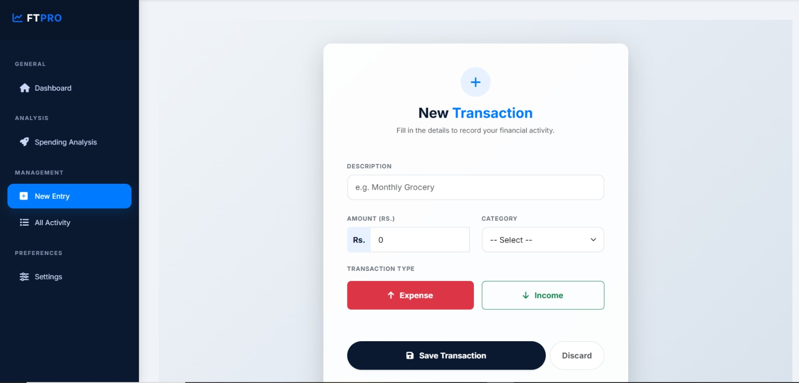
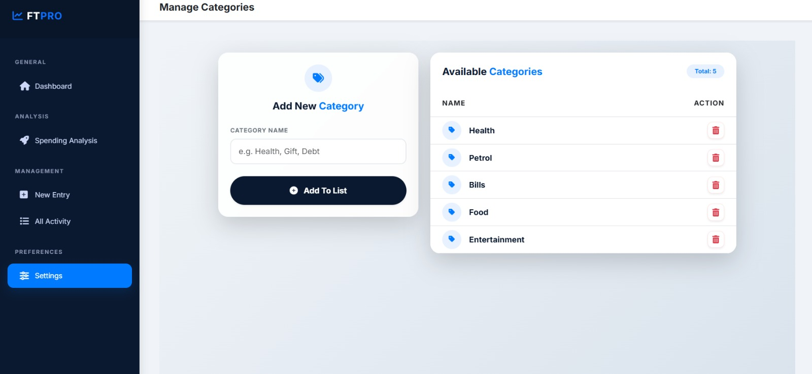

# FT PRO - Integrated Finance Control Dashboard
A Professional Hub for ASP.NET Core and MongoDB-based Financial Systems

## Project Overview
This project is a high-performance web solution engineered to unify personal financial management into a single, intuitive web interface. It allows users to track expenses, manage income, and analyze financial progress through a modern, Azure-inspired dashboard. 

The application serves as a seamless bridge between complex NoSQL data storage (MongoDB) and a user-friendly digital experience. Iye aapke personal budget ko effectively manage aur visualize karne ke liye banaya gaya hai.

---

## Key Modules and Features

### 1. Intelligent Dashboard
The central command center providing a high-level summary of your financial status.
- Total Balance Card: Real-time calculation of available funds.
- Income vs Expense Overview: Quick visual indicators of monthly cash flow.
- Recent Activity: A snapshot of the latest 5 transactions fetched directly from MongoDB.

### 2. Spending Analysis and Progress
Data-driven insights to help you understand your financial habits.
- Category Breakdown: Precise tracking of spending across categories like Food, Rent, and Entertainment.
- Progress Tracking: Dynamic progress bars to monitor monthly budget limits and savings goals.
- Visual Charts: Graphical representation of spending patterns over time for better analysis.

### 3. Transaction Management (Income and Expense)
Simplified tools to log and audit every financial movement.
- New Entry System: Dedicated forms for recording both Income and Expense transactions.
- Detailed History Ledger: A searchable audit trail of all past transactions with filtering options.
- Real-time Validation: Ensures all financial data is accurate before persistence.

### 4. User Preferences and Settings
Tailor the application to your specific needs.
- Profile Management: Customize user display details and regional settings.
- UI/UX Control: Azure-themed professional interface optimized for clarity and ease of use.

---

## Technical Stack
- Framework: C# ASP.NET Core 8.0 (MVC)
- Database: MongoDB (NoSQL)
- Containerization: Docker and Docker Desktop
- Frontend: Custom CSS3 (Azure Theme), HTML5, JavaScript

---

## Docker Implementation and Setup Guide

This project is fully containerized to ensure consistent behavior across all environments.

### 1. Database Configuration
To connect the Docker container to your local Windows MongoDB instance, update the appsettings.json file as follows:

"MongoDB": {
  "ConnectionString": "mongodb://host.docker.internal:27017",
  "DatabaseName": "FinanceTrackerDB"
}

### 2. Build and Execution Instructions
Run these commands in your PowerShell terminal inside the project root directory:

# Step 1: Build the Docker Image
docker build -t finance-tracker-app .

# Step 2: Stop and Remove any existing containers
docker stop ft-pro-live
docker rm ft-pro-live

# Step 3: Run the Container
docker run -d -p 8080:80 -e ASPNETCORE_ENVIRONMENT=Development -e ASPNETCORE_URLS=http://+:80 --name ft-pro-live finance-tracker-app

### 3. Accessing the Application
Once the container is running, open your browser and navigate to:
http://localhost:8080

---

## Screenshots

Aap yahan project ke mukammal interface ka overview dekh sakte hain:

### Dashboard Overview

### Spending Analysis

### Add Transaction

### Transaction History

### User Settings

---

## License
This project is developed for educational and portfolio purposes.
